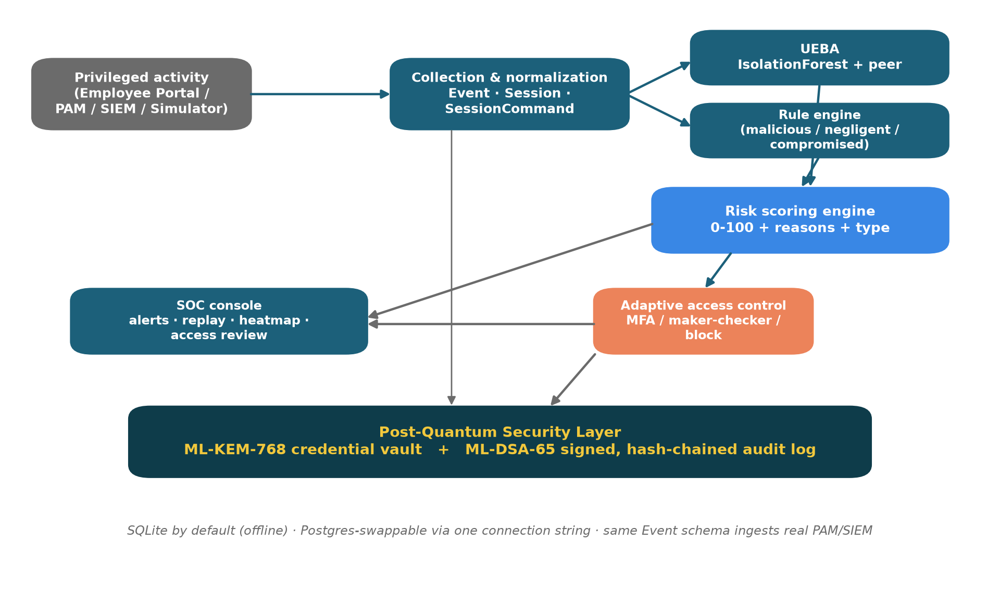
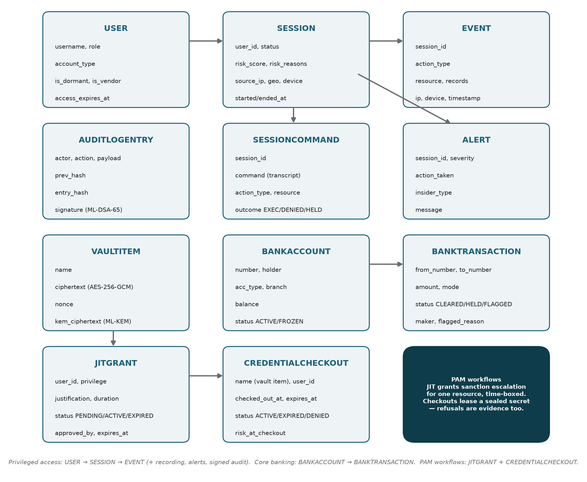
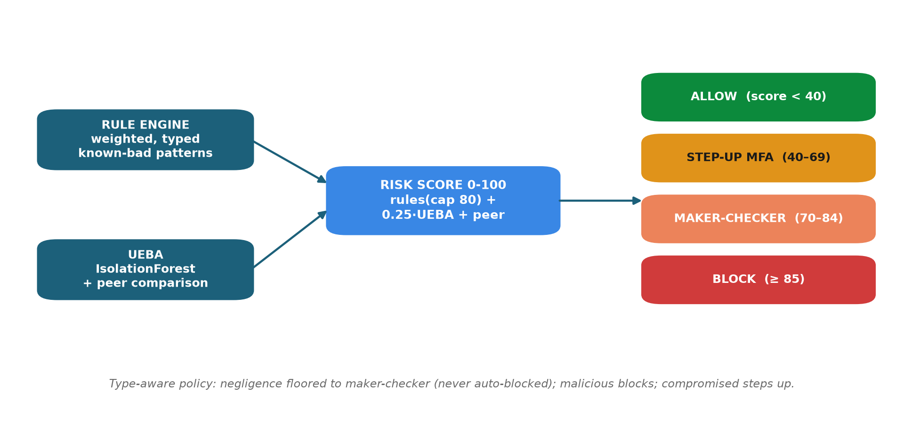
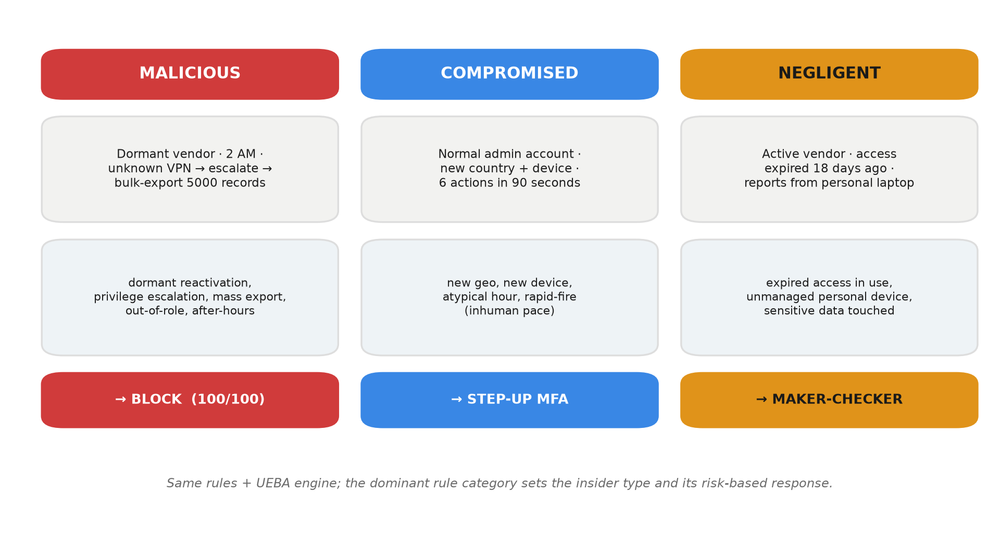
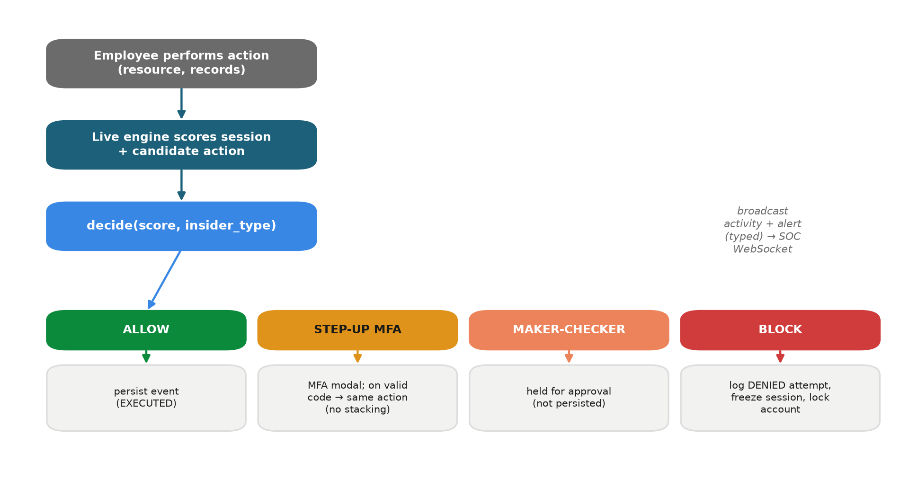
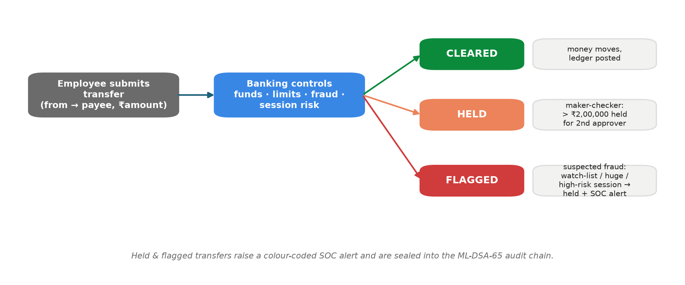
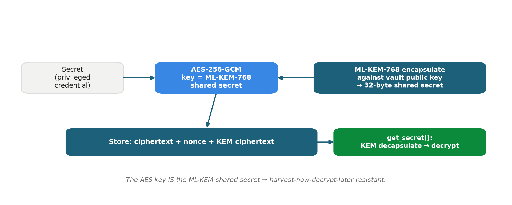
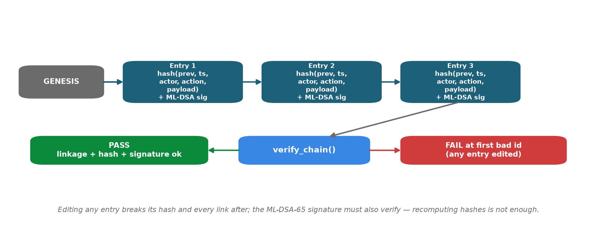

# Executive Summary

**Prahari** ("sentinel") is a Privileged Access Management (PAM) *and* insider-threat detection platform for banks. It sits between privileged staff — DBAs, sysadmins, network and application admins, and vendors — and critical systems, and does four things for every privileged session:

- **Watches** every privileged action as a normalized, **recorded** session with a replayable command trail.
- **Scores** each session **0–100 in real time**, fusing a rule engine with AI behavioural analytics (UEBA) and peer comparison, always with a human-readable *why*.
- **Responds** adaptively — **ALLOW / STEP-UP MFA / MAKER-CHECKER / BLOCK** — tagged with the detected **insider type**.
- **Protects** its own credentials and audit log with **NIST post-quantum cryptography** (ML-KEM-768 vault and ML-DSA-65 signed hash-chain).

Risk-based control runs **from the front door to the last artefact**: a risky account must pass **step-up MFA at login**; privilege elevation needs an approved, auto-expiring **just-in-time (JIT) grant**; privileged secrets are released only through a **time-boxed, risk-gated credential checkout** from the quantum-safe vault; and every incident can be exported as an **ML-DSA-signed evidence pack**. The detector is **measured, not just claimed**: on a held-out benchmark it detects 100% of the scripted attacks with the correct response and type, with zero false blocks on benign sessions.

It ships as a real two-sided product: an **Employee Portal** — a working core-banking desk (accounts, payments, transactions, approvals) where staff act and both fraud controls and insider enforcement happen live — and a **SOC Console** where analysts watch, replay sessions, review access, lock or clear a session, and verify the audit chain. It runs **fully offline** on SQLite and is one connection string away from PostgreSQL. The post-quantum layer needs **no compiler**: it auto-selects a native library when present and falls back to a pure-Python implementation otherwise, so any teammate can launch it.

**All six judged outcomes are delivered:** detect misuse of privileged accounts; identify insider threats in real time; AI-driven behavioural analysis; risk-based access control; protect critical administrative systems; and quantum-proof cryptography for credentials and audit artefacts.

# Problem and Context

Traditional bank security — firewalls, antivirus, perimeter IAM — is built for **outsiders**. It is largely blind to a **trusted insider** who already holds privileged access. Problem Statement 1 names three insider archetypes explicitly, all of which must be demonstrable: **malicious**, **negligent**, and **compromised**.

Common failure modes in privileged access:

- **Dormant and vendor accounts** never deactivated — a classic entry point.
- **Privilege escalation** performed outside the grant process.
- **Mass export** of customer records; **after-hours** bulk access.
- **Expired vendor access** still in daily use (negligence).
- **Account takeover** — new geography or device, inhuman action pace (compromise).
- **Tamperable audit logs** — the insider edits the evidence.
- **"Harvest-now, decrypt-later"** — credentials and evidence encrypted with classical cryptography today may be broken by future quantum computers.

**Why we chose it.** It carries the highest business impact for a bank — fraud loss, RBI compliance, and customer trust — and it lets us combine real-time AI/UEBA, PAM controls, and post-quantum cryptography into one coherent, defensible solution.

# Solution Overview

Prahari performs four steps, in order, for every privileged session: record and normalize the activity, score it, enforce an adaptive response, and protect the resulting evidence with post-quantum cryptography. Two role-based experiences sit behind one login:

- **Employee Portal** — a privileged-access console where staff perform actions (query, file access, configuration change, privilege escalation, bulk export). Each action is scored and **enforced live** before it takes effect.
- **SOC Console** — the analyst's control room: live sessions, a risk gauge, insider-type-tagged alerts, a why-flagged panel, a session timeline, **privileged-session replay**, a risk heatmap, a **PAM access review**, and post-quantum audit **verify / tamper** controls.

# System Architecture

Six modules carry activity from ingestion through analytics, scoring, response, and the post-quantum security layer.

{width=100%}

The Employee Portal, and in production any PAM/SIEM feed, map onto the same normalized `Event` schema; the built-in simulator produces the same shape for the demo.

**Technology stack**

| Layer | Choice |
|---|---|
| Backend / API | Python 3.14, FastAPI + Uvicorn |
| Storage | SQLAlchemy ORM · SQLite (default) -> PostgreSQL-swappable |
| AI / UEBA | scikit-learn IsolationForest + peer baselining |
| Post-quantum crypto | ML-KEM-768 (FIPS 203), ML-DSA-65 (FIPS 204); AES-256-GCM. Native liboqs when present, else pure-Python (kyber-py / dilithium-py) — no compiler |
| Authentication | PBKDF2-HMAC-SHA256 passwords + HMAC-signed tokens (standard library) |
| Real-time | FastAPI WebSocket |
| Frontend | React 19 + Vite + Tailwind 4 (+ Recharts) |
| Packaging | Docker + docker-compose · run.ps1 / run.sh |
| Testing | pytest (54 tests) |

# Data Model

Eleven ORM entities capture the workforce, their recorded sessions and actions, the detection output, the post-quantum artefacts, the core-banking ledger, and the PAM workflows.

{width=100%}

`JitGrant` and `CredentialCheckout` are the **PAM workflows** (just-in-time elevation and vault checkout — see below); `BankAccount` and `BankTransaction` are the **core-banking ledger** that the Employee Portal reads and writes (see *Core Banking Operations*); `SessionCommand` is the **privileged-session recording**: every action writes a realistic command line (for example, `psql core-banking-db -c "COPY customers TO '/tmp/out.csv' CSV;" -- 5000 rows`) with an outcome, so a session replays like a terminal transcript.

**Seeded cast** (all password `prahari123`):

| Username | Role | Notes |
|---|---|---|
| rmehta, spatil | DBA | permanent staff |
| akulkarni, pjoshi | SYSADMIN | permanent staff (akulkarni = compromised-scenario subject) |
| vdeshmukh | NET_ADMIN | permanent staff |
| nshinde | APP_ADMIN | permanent staff |
| ext_dsouza | CONTRACTOR | dormant vendor, access expired 120 days -> malicious attacker |
| ext_rao | CONTRACTOR | active vendor, access expired 18 days -> negligent subject |
| soc_admin | SOC_ANALYST | logs into the SOC console (account_type = ANALYST) |

# Detection Engine

Two detectors feed one scorer.

## Rule engine

Each rule returns a **reason**, a **weight**, and an **insider_type** tag.

| Rule | Fires when | Weight | Type |
|---|---|---|---|
| DORMANT_REACTIVATION | a dormant account logs in | 30 | malicious |
| PRIVILEGE_ESCALATION | a privilege-change event occurs | 25 | malicious |
| AFTER_HOURS_ACCESS | activity between 00:00 and 06:00 | 20 | malicious |
| MASS_EXPORT | at least 1000 records in one session | 30 | malicious |
| NO_BUSINESS_RELATIONSHIP | resource outside the user's role | 15 | malicious |
| NEW_GEO | login location is not the home location | 16 | compromised |
| NEW_DEVICE | unrecognized device **with** a foreign location | 12 | compromised |
| ATYPICAL_HOUR | login in an off-shift hour (06, 20–23) | 8 | compromised |
| RAPID_FIRE | at least 5 actions within 180 seconds (inhuman pace) | 8 | compromised |
| EXPIRED_ACCESS_IN_USE | the user's access grant has lapsed | 30 | negligent |
| UNMANAGED_DEVICE | sensitive data from a new device at the **home** location | 30 | negligent |

The **dominant insider type** of a session is the category carrying the most rule weight (tie-break priority: malicious, then compromised, then negligent).

**JIT-aware escalation.** A privilege change covered by an **ACTIVE just-in-time grant** (approved by an analyst, time-boxed, auto-expiring) is *sanctioned*: PRIVILEGE_ESCALATION does not fire for that one resource, and the reason list says so. The moment the grant expires, the rule re-arms — so the same click is an alarm again.

**Device disambiguation.** A new device *with* a foreign geography reads as account takeover (`NEW_DEVICE`, compromised); a new device from the *home* location reads as a personal, unmanaged laptop (`UNMANAGED_DEVICE`, negligent). This keeps the two families cleanly separated.

## UEBA — behavioural analytics

Every session becomes a 7-feature vector: `login_hour, event_count, total_records, distinct_resources, config_changes, offsite_ip, new_device`.

- An **IsolationForest** (100 trees) is trained on **closed historical sessions**, including **cumulative prefixes** of each session — so live sessions (which arrive one action at a time) are in-distribution and normal early activity is not flagged merely for being short.
- The raw anomaly is normalized to **0–100** against the baseline distribution (median maps to 0, first percentile maps to 100).
- **Peer comparison** measures the session's record volume against the same-role average — for example, "5000× more records than CONTRACTOR peers".

## Risk scoring

The final score fuses the two detectors:

$$\text{score} = \min\!\big(\; \text{rule\_weight (capped at 80)} \;+\; 0.25 \times \text{UEBA\_anomaly} \;+\; \text{peer\_bonus (10 if} \geq 5\times \text{peers)}, \; 100 \big)$$

UEBA is a **secondary nudge** (at most 25 points): the stable, explainable rule engine sets the band; the behavioural model refines within it. Every score ships a reason list (the "why-flagged" panel) and the insider type.

## Measured performance

The detector is benchmarked on a **held-out sandbox** (30 days of simulated benign privileged activity on an independent seed, plus the three scripted attack patterns — ground truth exact by construction, nothing touches the live database):

| Metric | Result |
|---|---|
| Attack detection rate | **100%** (3/3, each with the correct response *and* insider type) |
| False blocks on benign sessions | **0** of 230 |
| False-alarm rate (any challenge/hold) | **1.7%** |

The numbers are live in the SOC (*AI Model Insights -> Measured Performance*) and via `GET /soc/model/eval`; the benchmark itself is a regression test in the suite.

{width=100%}

# The Three Insider Types

Three scripted scenarios (one SOC button each) prove three **distinct** response paths. The behaviour is verified live and by automated tests on an independent random seed.

{width=100%}

| Scenario | Dominant signals | Score band | Response |
|---|---|---|---|
| **Malicious** | dormant + escalation + mass-export + out-of-role + after-hours | >= 85 | **BLOCK** |
| **Compromised** | new geo + new device + atypical hour + rapid-fire | 40–69 | **STEP-UP MFA** |
| **Negligent** | expired access + unmanaged device | 70–84 | **MAKER-CHECKER** |

**Type-aware policy.** Negligence is a control failure to remediate with a **human second-check**, not an attack to hard-block — so a negligent session is **floored to maker-checker review** and **never escalated to an automated block**. Malicious blocks; compromised steps up. This is enforced in `decide(score, insider_type)`.

# Adaptive Response and PAM

## Live enforcement

Each portal action re-scores the **whole session including the candidate action**, then enforces the decision **before the action takes effect**.

{width=100%}

Key safety properties:

- **Blocked accounts stay locked.** A blocked session is returned on re-login; a blocked user cannot open a fresh session to continue.
- **No score-gaming.** Challenged actions (MFA or maker-checker) are **not persisted** until actually allowed, so retrying does not inflate the session.
- **Server-side enforcement.** The API refuses to execute; the UI overlay is cosmetic.

## PAM surface

- **Privileged-session recording** (`GET /soc/sessions/{id}/commands`) — the replayable command trail; blocked commands show as DENIED (struck through), held ones as HELD.
- **Access review** (`GET /soc/access-review`) — every privileged account with standing-risk flags (DORMANT / VENDOR / EXPIRED) and a risk rating, surfacing lingering access *before* anything happens.
- **Maker-checker approval** (`POST /soc/sessions/{id}/approve`) — an analyst approves a held session; the approval is written to the signed audit log.

## Just-in-time (JIT) access — no standing privilege

Privilege elevation is a **workflow, not a right**: an employee requests elevation for **one resource** with a business justification and a duration (max 60 minutes); an SOC analyst approves or denies it from the **JIT & Credentials** queue; an approved grant is **time-boxed and auto-expires**. While ACTIVE, the grant *sanctions* escalation on exactly that resource (see the rule engine above); on expiry the engine re-arms automatically. Every request, decision, and expiry is sealed to the signed audit log.

## Credential checkout — the vault as a workflow

Privileged secrets (database root, payment-gateway key, SWIFT passphrase) live **ML-KEM-768-sealed** in the vault and are released only through a checkout: a **5-minute lease** with a live countdown, signed into the audit chain. The same risk score that drives session enforcement gates the vault — a session at **risk >= 70 or blocked is refused**, the refusal raises a CRITICAL SOC alert, **and the refusal itself is recorded as evidence**. The SOC sees every checkout and denial (`GET /soc/checkouts`).

## Risk-based authentication (adaptive login)

A correct password is not enough for a risky account. At login, Prahari checks the same context signals the detection engine scores — **dormant account, expired access grant, unrecognized network/device** — and any hit demands the **step-up MFA code before a token is issued**. Challenges, failures (which also alert the SOC), and verifications are all written to the signed audit chain.

## Signed incident reports

`GET /soc/sessions/{id}/report` (the SOC's **Evidence pack** button) exports a self-contained incident document — session facts, recorded command transcript, per-action risk trajectory, model insights, alerts, audit extract, and chain status — whose canonical JSON is **hashed and ML-DSA-65-signed**, so the exported file is itself verifiable evidence a bank can hand to compliance.

## Analyst response actions

The SOC Console turns a flagged session into a one-click decision, each written to the signed audit log and broadcast live:

- **Lock account** (`POST /soc/sessions/{id}/lock`) — force-blocks the session and disables the account; the next login is refused.
- **Approve / clear** (`POST /soc/sessions/{id}/approve`) — releases a held session for the maker-checker path.
- **Dismiss** (`POST /soc/sessions/{id}/dismiss`) — marks a flag as a reviewed false-positive and clears it from the live board.

## Explainable model view

- **Model card** (`GET /soc/sessions/{id}/model`) — the UEBA feature breakdown for the session: each feature's value, the user's own baseline, the peer baseline, and its contribution to the anomaly, so an analyst sees *why the model reacted*, not just the number.
- **Risk trajectory** (`GET /soc/sessions/{id}/trajectory`) — the score after each action, rendered as a sparkline, showing exactly where the session crossed a response threshold.
- **Impact metrics** (`GET /soc/metrics`) — a live strip of program impact: sessions watched, threats blocked, money held or flagged, and mean time to decision.

# Core Banking Operations

The Employee Portal is a **working core-banking desk**, not a mock: staff open accounts, move money, and clear approvals against a real ledger (`BankAccount`, `BankTransaction`). This is what makes insider risk concrete — the same transfer that a portal user submits is the one Prahari scores and, when needed, holds or blocks.

{width=100%}

Every transfer (`POST /bank/transfer`) runs three gates in `app/bank.py` before money moves:

| Outcome | Trigger | Effect |
|---|---|---|
| **FLAGGED** (fraud) | watchlisted beneficiary, amount >= Rs 10,00,000, or live session risk >= 70 | money does **not** move; a **CRITICAL** alert is raised to the SOC |
| **HELD** (maker-checker) | amount > Rs 2,00,000 | money does **not** move; queued for a second officer to approve or reject |
| **CLEARED** | none of the above, sufficient funds, active source account | money moves immediately |

Insufficient funds or a frozen source account are refused outright. Held transfers settle only on `POST /bank/transactions/{id}/approve` (a different officer) and reverse on `.../reject`. A high-value or fraudulent transfer **flashes a banner** in the portal and surfaces as a typed alert in the SOC, closing the loop between the banking floor and the analyst.

# Post-Quantum Security Layer

All post-quantum operations sit behind one abstraction, `app/security/pqc.py`, exposing `kem_keypair`, `kem_encapsulate`, `kem_decapsulate`, `sign`, and `verify` over **ML-KEM-768** (FIPS 203) and **ML-DSA-65** (FIPS 204).

**Portable by design — no compiler required.** The module selects a provider at import time: a **native liboqs** binding if one is installed, otherwise a **pure-Python** implementation (`kyber-py` / `dilithium-py`). Nothing to build, no C toolchain, no `cmake` — so a teammate cloning the repo never hits the *"No oqs shared libraries found"* wall. `GET /pqc/info` reports the active provider, and `PRAHARI_PQC=pure` forces the fallback for a reproducible demo. The two providers are interchangeable and the same FIPS algorithms and test suite cover both.

## Credential vault

{width=95%}

The AES key **is** the ML-KEM shared secret; decryption requires the vault's KEM secret key. Data recorded today cannot be decrypted later, even by a quantum adversary.

## Tamper-evident audit log

{width=95%}

Each entry hash-chains the previous entry **and** is ML-DSA-65 signed. Editing any entry breaks its hash and every subsequent link; recomputing hashes is not enough, because the signature must still verify with the audit public key. `POST /demo/tamper` flips one record live, and `verify_chain()` then fails at the exact entry.

# Authentication and Authorization

- **Passwords** — PBKDF2-HMAC-SHA256 (200,000 rounds, per-user salt), in `app/security/auth.py`.
- **Risk-based login** — dormant / expired / unrecognized-context accounts must pass step-up MFA at the door before any token is issued (audit-chained; failures alert the SOC).
- **Tokens** — compact HMAC-SHA256-signed, JWT-like tokens with expiry, verified on every request.
- **Roles** — `EMPLOYEE` routes to the Employee Portal; `ANALYST` routes to the SOC Console. SOC endpoints are gated with `require_analyst` (HTTP 403 for employees). The WebSocket feed is broadcast-only.

This layer is demo-grade by design; a production deployment swaps in the bank's IdP/SSO behind the same dependency.

# API Reference

| Method | Endpoint | Auth | Purpose |
|---|---|---|---|
| POST | /auth/login | – | issue token; risky accounts get an MFA challenge first |
| GET | /auth/me | any | current identity |
| POST | /portal/bootstrap | employee | open live session + catalog + resources |
| POST | /portal/action | employee | perform action -> scored and enforced |
| POST | /portal/logout | employee | close session |
| GET | /soc/overview | analyst | users, scored history, heatmap, live sessions |
| GET | /soc/live | analyst | active / blocked sessions (typed) |
| GET | /soc/alerts | analyst | recent alerts (typed) |
| GET | /soc/access-review | analyst | PAM dormant / vendor / expired table |
| GET | /soc/sessions/{id}/commands | analyst | session recording replay |
| GET | /soc/sessions/{id}/events | analyst | session events |
| POST | /soc/sessions/{id}/approve | analyst | approve / clear a held session |
| POST | /soc/sessions/{id}/lock | analyst | force-block session + disable account |
| POST | /soc/sessions/{id}/dismiss | analyst | mark a flag reviewed (false-positive) |
| GET | /soc/sessions/{id}/model | analyst | UEBA feature breakdown (explainable) |
| GET | /soc/sessions/{id}/trajectory | analyst | per-action score trajectory |
| GET | /soc/sessions/{id}/report | analyst | ML-DSA-signed incident evidence pack |
| GET | /soc/model/eval | analyst | measured detector performance (held-out benchmark) |
| GET | /soc/metrics | analyst | live impact metrics strip |
| GET | /soc/jit | analyst | JIT approval queue |
| POST | /soc/jit/{id}/approve, /deny | analyst | decide a JIT elevation request |
| GET | /soc/checkouts | analyst | every credential checkout and refusal |
| POST | /jit/request | employee | request time-boxed elevation (justified) |
| GET | /jit/mine | employee | my JIT grants with live status/expiry |
| GET | /vault/credentials | employee | the credential desk + my checkout history |
| POST | /vault/checkout | employee | risk-gated, time-boxed secret checkout |
| GET | /bank/accounts, /transactions | employee | account list / ledger |
| GET | /bank/pending, /beneficiaries | employee | held queue / payees |
| POST | /bank/transfer | employee | submit a transfer -> fraud + risk gated |
| POST | /bank/transactions/{id}/approve | employee | settle a held transfer (second officer) |
| POST | /bank/transactions/{id}/reject | employee | reverse a held transfer |
| POST | /demo/scenario/{kind} | analyst | run scripted malicious / compromised / negligent |
| POST | /demo/tamper | analyst | edit an audit entry (proves detection) |
| GET | /audit, /audit/verify | analyst | list / verify the signed chain |
| GET | /pqc/info | any | active PQC provider and algorithms |
| POST, GET | /vault/secrets | analyst | store / retrieve a PQC-wrapped secret |
| WS | /ws/feed | – | live activity / alert / tamper frames |
| GET | /health | – | liveness |

Interactive API docs are served at `/docs` (FastAPI / OpenAPI).

# Frontend

React 19 + Vite + Tailwind 4, dark SOC theme, served by FastAPI from `frontend/dist` (same-origin, offline).

- **Login** (`pages/Login.jsx`) — role-routed, with a demo-account helper.
- **Employee Portal** (`pages/Portal.jsx`) — a working banking desk (Accounts, Payments, Transactions, Approvals) with a fraud/high-value **flash banner** and live KPIs, plus the privileged-action console: connection badge, live risk gauge, activity timeline, MFA modal, maker-checker banner, and a full-screen BLOCK overlay.
- **SOC Console** (`pages/SocConsole.jsx`) — three scenario buttons, an audit banner, an impact-metrics strip, one-click **Lock / Approve / Dismiss** response actions with toast feedback, an **AI Model Insights** panel (feature breakdown + baselines) and risk-trajectory sparkline, and panels: live sessions (typed), risk gauge, why-flagged, alerts (typed), timeline, session recording (terminal replay), heatmap, and access review.

The colour system reserves status colours (good / warning / serious / critical), colour-codes insider types (malicious red, compromised blue, negligent amber), uses tabular numerics, flashes on new alerts, and never encodes meaning by colour alone.

# Security Considerations

- **Data minimization** — scores on privileged-activity metadata; no customer PII required.
- **Credential protection** — an ML-KEM-768-wrapped AES-256-GCM vault for privileged secrets.
- **Audit integrity** — hash-chained and ML-DSA-65-signed entries; tampering is cryptographically evident.
- **Enforcement** — server-side; blocked accounts stay locked; a challenged action is not persisted until actually allowed (no score-gaming, no bypass by re-login).
- **Authorization** — role-gated APIs; analyst-only SOC and PQC endpoints.
- **Offline by design** — no external calls at runtime; keys kept out of version control; `.env`-driven configuration; least-privilege demo accounts.
- **Explainability and compliance** — every decision has a plain-English reason, an immutable trail, and access reviews for standing, dormant and expired grants.

# Scalability

- **Stateless scoring** — scale horizontally behind a load balancer; each request scores one session.
- **Storage** — SQLite to PostgreSQL by changing one connection string (pure ORM, no raw SQL).
- **Real-time fan-out** — WebSocket behind a Redis or Kafka broker to serve many SOC clients and high event throughput.
- **Ingestion** — generalizes to enterprise PAM/SIEM feeds (millions of privileged events per day) on the same `Event` schema.
- **Machine learning** — models retrain per role and shift nightly; a feature store holds baselines; the UEBA interface accepts an autoencoder upgrade with no application changes.
- **Post-quantum operations** — ML-KEM encapsulation and ML-DSA signing are sub-millisecond, negligible next to a database write.

# Deployment and Running

```powershell
# Windows PowerShell
.\run.ps1              # venv + deps + seeded DB + UI + API (offline)
.\run.ps1 -Reset       # wipe and reseed for a clean demo
```

```bash
# Git Bash / Linux / macOS
./run.sh               # same, POSIX

docker compose up --build      # container alternative
```

Then open `http://127.0.0.1:8000`. The first run on a fresh machine needs internet once for `pip install` — there is **no compiler step** (the post-quantum layer ships a pure-Python fallback); afterwards it is fully offline. For a two-computer LAN demo the server binds `0.0.0.0` so a second machine reaches it at `http://<host-ip>:8000`. Run tests with `.venv/Scripts/python -m pytest`.

# Testing

The suite contains **54 pytest tests**, including:

- **test_simulator** — user seeding, normal-day realism, determinism.
- **test_detection** — every rule, normal-versus-attack scoring, quiet-on-normal.
- **test_scenarios** — the three insider scenarios land on distinct, correct paths and the type-aware policy holds (negligence never auto-blocks), on an independent seed.
- **test_phase3** — attack block, alert, and the WebSocket loop.
- **test_portal** — authentication, role gating, live enforcement, MFA without event stacking, and blocked-stays-locked.
- **test_pqc** — KEM round-trip, sign/verify with forgery rejection, vault round-trip, and audit chain clean / tamper / signature-forgery (run against both PQC providers).
- **test_bank** — transfers move money, high-value holds, watchlist / huge-amount / high-risk-session transfers flag, held transfers settle on approval, and insufficient-funds / frozen-account transfers are refused.
- **test_pam_plus** — risk-based login (challenge / wrong-code alert / verified token), credential checkout (lease, high-risk refusal recorded as evidence, expiry, SOC oversight), the full JIT lifecycle (request -> approve -> sanctioned escalation -> auto-expiry -> re-armed rule), the measured-performance benchmark, and the signed incident report (signature verifies; tampered report fails).

# Demo Walkthrough

Full narration is in `DEMO_SCRIPT.md`. In brief (two browser windows, side by side):

1. **SOC Console** (`soc_admin`) — quiet, with a green heatmap and the impact-metrics strip.
2. **Risk-based login** — signing in as `ext_dsouza` triggers the step-up challenge at the door (dormant, expired, unrecognized context); code `246810` gets the "attacker" in.
3. **Employee Portal** (`rmehta`) — a normal query is ALLOWED; an export of 1200 records triggers STEP-UP MFA. On the **banking desk**, a small transfer clears instantly, a high-value one is **HELD** for maker-checker, and a transfer to a watchlisted payee is **FLAGGED** and flashes a banner — surfacing as a CRITICAL alert in the SOC.
4. **JIT + vault** — an unsanctioned escalation alarms; after an analyst approves a JIT grant it is sanctioned; a credential checkout unseals a secret for a 5-minute lease.
5. **Attacker** (`ext_dsouza`) — escalate then export 5000 records -> full-screen BLOCK; the account is locked; the vault refuses him.
6. **SOC lights up** — a red live session at 100, a flashed CRITICAL alert tagged `malicious`, the why-flagged panel, the session replay (export struck through as DENIED), and a red heatmap cell.
7. **Two more insider types** — the SOC buttons run Compromised -> MFA and Negligent -> maker-checker, each correctly typed.
8. **Explainable + measured AI** — the Model Insights panel (feature attribution, trajectory) and the held-out benchmark numbers.
9. **Quantum-safe evidence** — Verify Chain (green), Tamper (red, FAILED at the exact entry), then export the **signed evidence pack** for the blocked session.

# Roadmap

- **PS2 correlation** — link a privileged record-change to a suspicious downstream transaction (the session-risk gate on transfers is the first step, already live).
- **Automated entitlement reviews** and credential auto-rotation on lease return.
- **Autoencoder** UEBA upgrade behind the same interface.
- **Enterprise integrations** — CyberArk / BeyondTrust PAM, Splunk / QRadar SIEM, IdP / SSO.
- **Workforce-wide insider-risk scoring** beyond privileged accounts.

# Repository Map

```
PRAHARI/
  app/
    main.py               FastAPI app + lifespan + static UI mount
    config.py             pydantic settings (.env)
    bank.py               core-banking engine (transfers, maker-checker, fraud)
    jit.py                just-in-time access (request/approve/expire)
    pam.py                session-command recording + access review
    api/routes.py         REST + WebSocket endpoints
    api/ws.py             WebSocket broadcast manager
    detection/rules.py    rule engine (3 insider types, typed)
    detection/ueba.py     IsolationForest + peer baseline (prefix-trained)
    detection/evaluate.py held-out benchmark (measured performance)
    detection/score.py    0-100 risk score + reasons + insider type
    detection/response.py type-aware adaptive response
    detection/live.py     live per-action scoring & enforcement
    models/entities.py    ORM entities
    security/auth.py      PBKDF2 passwords + HMAC tokens
    security/pqc.py       ML-KEM-768 / ML-DSA-65 (native or pure-Python)
    security/vault.py     quantum-safe credential vault
    security/audit.py     hash-chained + signed audit log
    simulator/            normal-day generator, 3 scenarios, seeder
  frontend/               React app (pages/ + components/) + prebuilt dist/
  tests/                  54 pytest tests
  docs/                   this documentation + submission deck
  DOCUMENTATION.md  DEMO_SCRIPT.md  PROJECT_STATUS.md  README.md
  run.ps1  run.sh  Dockerfile  docker-compose.yml  requirements.txt
```

*Prahari — the sentinel for privileged access. Detect with AI and rules, explain every decision, respond in real time, and keep the proof quantum-safe.*
