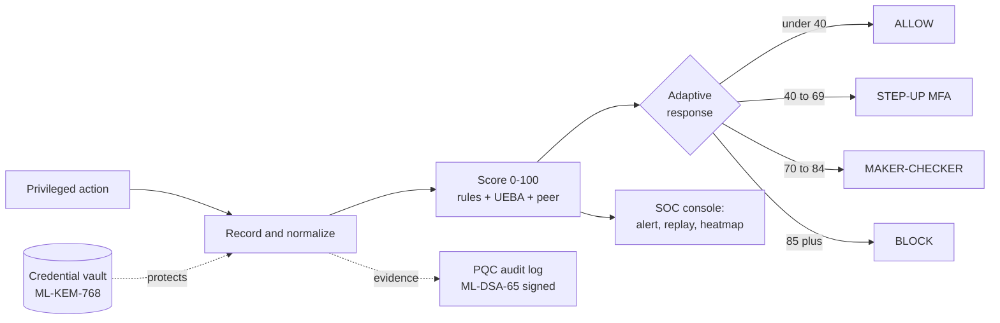
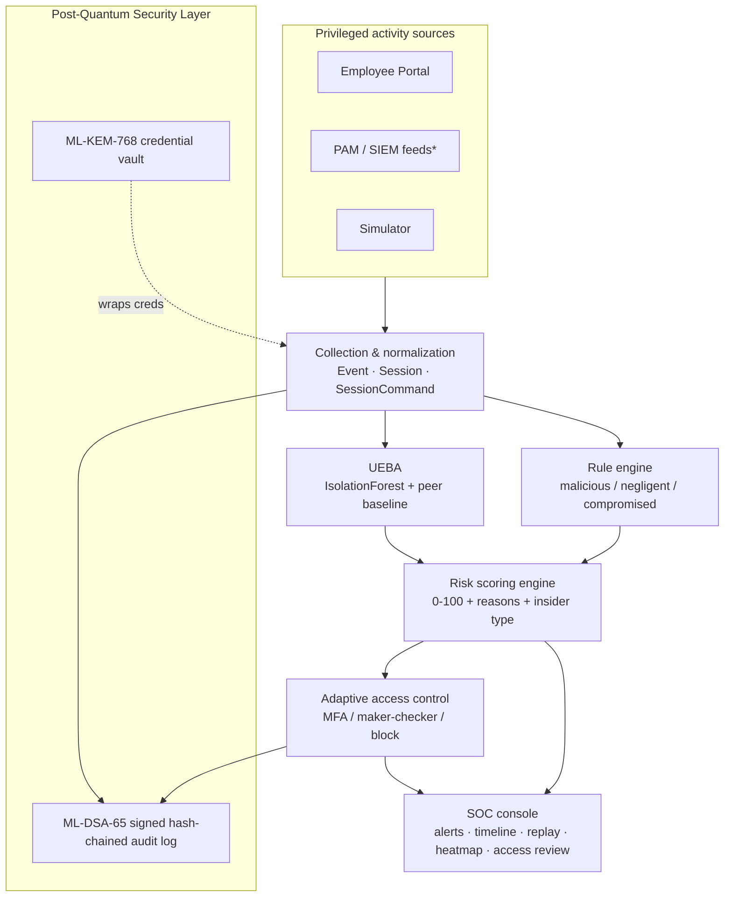
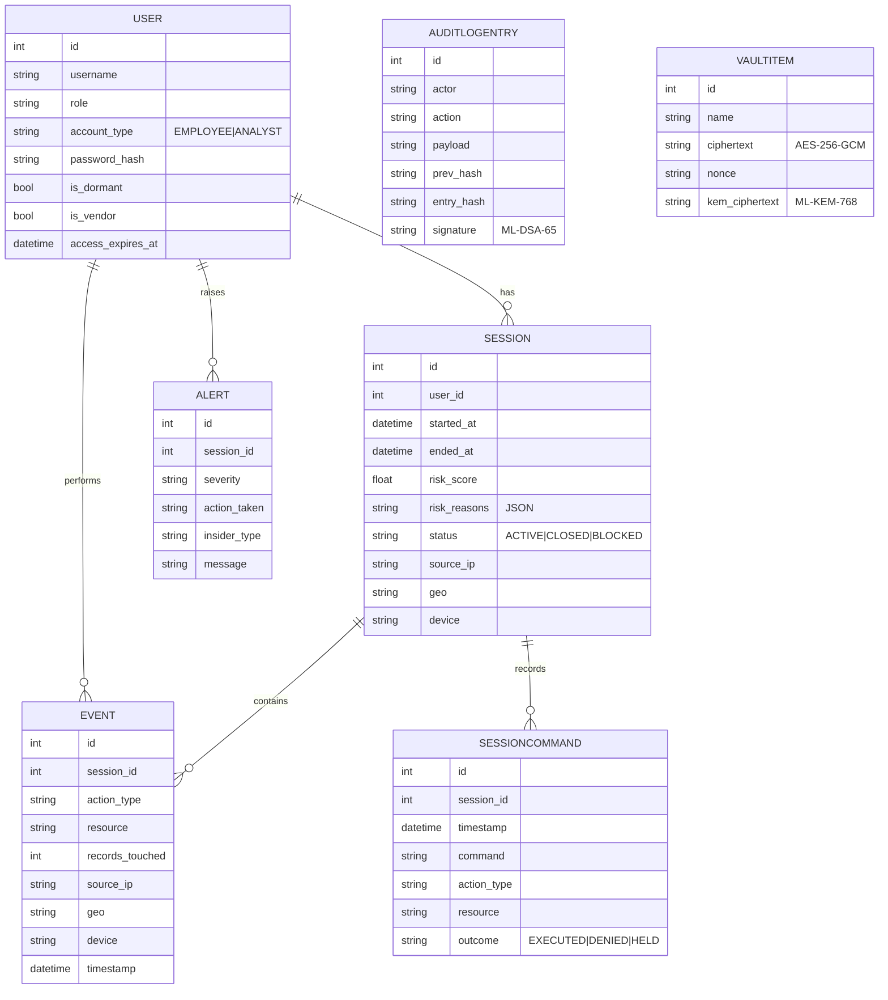
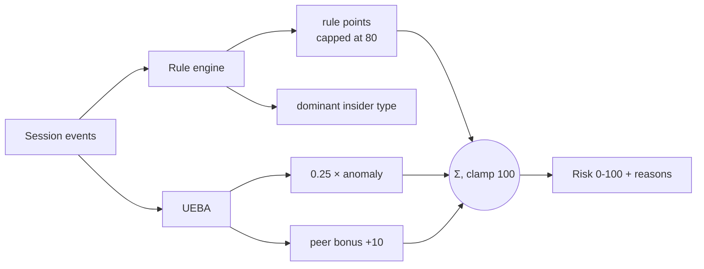
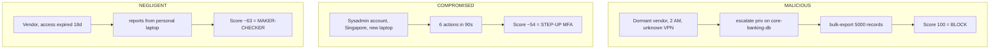
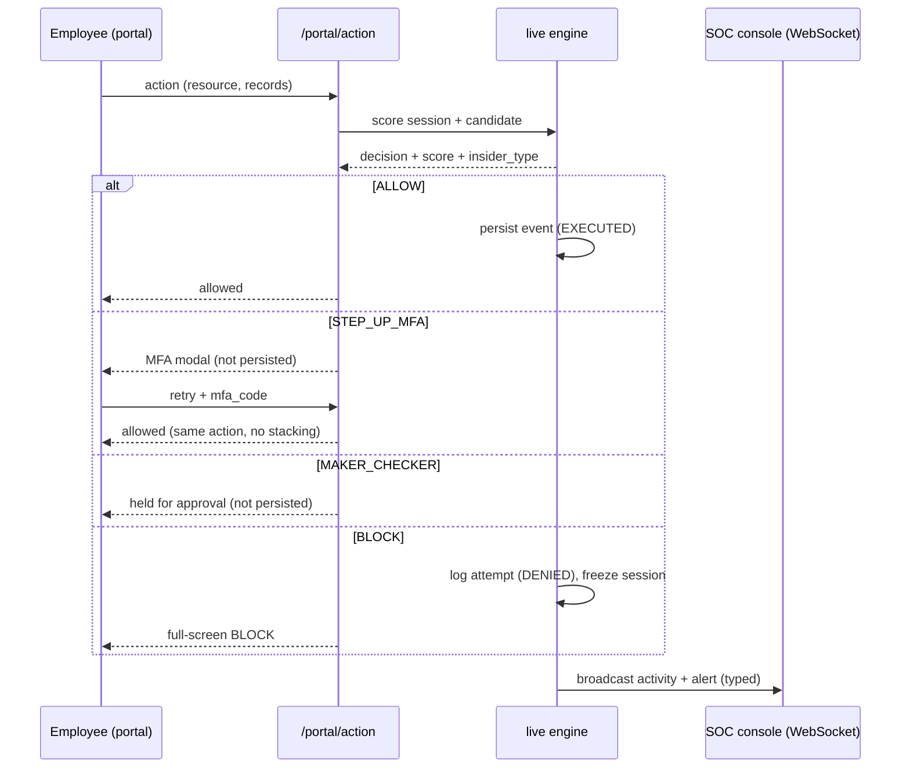
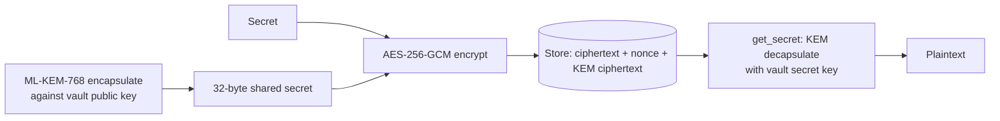
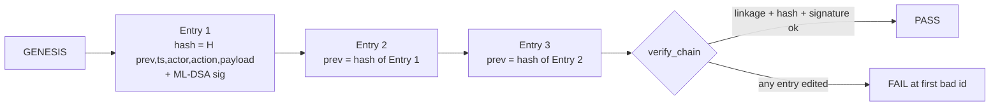

# Prahari — Complete Technical Documentation

**Privileged-Access Insider-Threat Detection & Management for Banks**
FinSpark'26 · Bank of Maharashtra · Problem Statement 1 — *Privileged Access Misuse & Insider Threat Detection*

> **One line:** catch a risky insider — whether **malicious, negligent, or compromised** — in real time, respond automatically, and keep the proof **quantum-safe**.

---

## Table of contents

1. [Executive summary](#1-executive-summary)
2. [Problem & context](#2-problem--context)
3. [Solution overview](#3-solution-overview)
4. [System architecture](#4-system-architecture)
5. [Data model](#5-data-model)
6. [Detection engine](#6-detection-engine)
7. [The three insider types](#7-the-three-insider-types)
8. [Adaptive response & PAM](#8-adaptive-response--pam)
9. [Post-quantum security layer](#9-post-quantum-security-layer)
10. [Authentication & authorization](#10-authentication--authorization)
11. [API reference](#11-api-reference)
12. [Frontend](#12-frontend)
13. [Security considerations](#13-security-considerations)
14. [Scalability](#14-scalability)
15. [Deployment & running](#15-deployment--running)
16. [Testing](#16-testing)
17. [Demo walkthrough](#17-demo-walkthrough)
18. [Roadmap](#18-roadmap)
19. [Repository map](#19-repository-map)

---

## 1. Executive summary

Prahari is a **Privileged Access Management (PAM) + insider-threat detection** platform for banks. It sits between privileged staff (DBAs, sysadmins, network/app admins, vendors) and critical systems, and:

- **Watches** every privileged action as a normalized, **recorded** session (replayable command trail).
- **Scores** each session **0–100 in real time** by fusing a **rule engine** with **AI behavioural analytics (UEBA)** and **peer comparison**, always with a human-readable *why*.
- **Responds** adaptively — **ALLOW / STEP-UP MFA / MAKER-CHECKER / BLOCK** — tagged with the detected **insider type**.
- **Protects** its own credentials and audit log with **NIST post-quantum cryptography** (ML-KEM-768 vault + ML-DSA-65 signed hash-chain).

It ships as a real two-sided product: an **Employee Portal** (staff act; enforcement happens live) and a **SOC Console** (analysts watch, replay sessions, review access, verify the audit chain). It runs **fully offline** on SQLite and is one connection string away from PostgreSQL.

**All six judged outcomes are delivered:** detect misuse of privileged accounts · identify insider threats in real time · AI-driven behavioural analysis · risk-based access control · protect critical admin systems · quantum-proof cryptography.

---

## 2. Problem & context

Traditional bank security (firewalls, AV, perimeter IAM) is built for **outsiders**. It is largely blind to a **trusted insider** who already holds privileged access. The problem statement names three insider archetypes explicitly — **malicious, negligent, and compromised** — all of which must be demonstrable.

Common failure modes:

- **Dormant / vendor accounts** never deactivated — a classic entry point.
- **Privilege escalation** outside the grant process.
- **Mass export** of customer records; **after-hours** bulk access.
- **Expired vendor access** still in daily use (negligence).
- **Account takeover** — new geography/device, inhuman action pace (compromise).
- **Tamperable audit logs** — the insider edits the evidence.
- **"Harvest-now, decrypt-later"** — credentials/evidence encrypted with classical crypto today may be broken by future quantum computers.

**Why we chose it:** it carries the highest business impact for a bank (fraud loss, RBI compliance, customer trust) and lets us combine real-time AI/UEBA, PAM controls, and post-quantum cryptography into one coherent, defensible solution.

---

## 3. Solution overview

Prahari does four things, in order, for every privileged session:



Two role-based experiences behind one login:

- **Employee Portal** — a privileged-access console where staff perform actions (query, file access, config change, privilege escalation, bulk export). Each action is scored and **enforced live** before it takes effect.
- **SOC Console** — the analyst's control room: live sessions, risk gauge, typed alerts, why-flagged panel, session timeline, **privileged-session replay**, risk heatmap, **PAM access review**, and PQC audit **verify / tamper** controls.

---

## 4. System architecture

Six modules, from ingestion to post-quantum protection:



<sub>* PAM/SIEM ingestion is the production integration story; the demo uses the built-in simulator + live portal, mapping to the same `Event` schema.</sub>

**Tech stack**

| Layer | Choice |
|---|---|
| Backend / API | Python 3.14, FastAPI + Uvicorn |
| Storage | SQLAlchemy ORM · SQLite (default) → PostgreSQL-swappable |
| AI / UEBA | scikit-learn `IsolationForest` + peer baselining |
| PQC | liboqs-python — ML-KEM-768 (FIPS 203), ML-DSA-65 (FIPS 204); AES-256-GCM |
| Auth | PBKDF2-HMAC-SHA256 + HMAC-signed tokens (stdlib) |
| Real-time | FastAPI WebSocket |
| Frontend | React 19 + Vite + Tailwind 4 (+ Recharts) |
| Packaging | Docker + docker-compose · run.ps1 / run.sh |
| Tests | pytest (31) |

---

## 5. Data model



**Seeded cast** (all password `prahari123`):

| Username | Role | Notes |
|---|---|---|
| `rmehta`, `spatil` | DBA | permanent staff |
| `akulkarni`, `pjoshi` | SYSADMIN | permanent staff (akulkarni = compromised-scenario subject) |
| `vdeshmukh` | NET_ADMIN | permanent staff |
| `nshinde` | APP_ADMIN | permanent staff |
| `ext_dsouza` | CONTRACTOR | **dormant vendor, access expired 120d** → malicious attacker |
| `ext_rao` | CONTRACTOR | **active vendor, access expired 18d** → negligent subject |
| `soc_admin` | SOC_ANALYST | logs into the SOC console (`account_type=ANALYST`) |

`SessionCommand` is the **privileged-session recording** — every action writes a realistic command line (e.g. `psql core-banking-db -c "COPY customers TO '/tmp/out.csv' CSV;" -- 5000 rows`) with an outcome, so a session replays like a terminal transcript.

---

## 6. Detection engine

Two detectors feed one scorer.

### 6a. Rule engine — `app/detection/rules.py`

Each rule returns a **reason**, a **weight**, and an **insider_type** tag.

| Rule | Fires when | Weight | Type |
|---|---|---|---|
| `DORMANT_REACTIVATION` | a dormant account logs in | 30 | malicious |
| `PRIVILEGE_ESCALATION` | a `PRIV_CHANGE` event occurs | 25 | malicious |
| `AFTER_HOURS_ACCESS` | activity in 00:00–06:00 | 20 | malicious |
| `MASS_EXPORT` | ≥ 1000 records in one session | 30 | malicious |
| `NO_BUSINESS_RELATIONSHIP` | resource outside the user's role | 15 | malicious |
| `NEW_GEO` | login location ≠ home | 16 | compromised |
| `NEW_DEVICE` | unrecognized device **with** a foreign location | 12 | compromised |
| `ATYPICAL_HOUR` | login in an off-shift hour (06, 20–23) | 8 | compromised |
| `RAPID_FIRE` | ≥ 5 actions within 180s (inhuman pace) | 8 | compromised |
| `EXPIRED_ACCESS_IN_USE` | user's access grant has lapsed | 30 | negligent |
| `UNMANAGED_DEVICE` | sensitive data from a new device at the **home** location | 30 | negligent |

The **dominant insider type** of a session is the category carrying the most rule weight (tie-break: malicious > compromised > negligent).

> **Design note — device disambiguation:** a new device *with* a foreign geo reads as account takeover (`NEW_DEVICE`, compromised); a new device from the *home* location reads as a personal/unmanaged laptop (`UNMANAGED_DEVICE`, negligent). This keeps the two families cleanly separated.

### 6b. UEBA — `app/detection/ueba.py`

Every session becomes a 7-feature vector:

```
[login_hour, event_count, total_records, distinct_resources,
 config_changes, offsite_ip, new_device]
```

- An **IsolationForest** (100 trees) is trained on **closed historical sessions**, including **cumulative prefixes** of each session — so live sessions (which arrive one action at a time) are in-distribution and normal early activity isn't flagged just for being short.
- The raw anomaly is normalized to **0–100** against the baseline distribution (median → 0, 1st percentile → 100).
- **Peer comparison:** the session's record volume vs the same-role average → *"5000× more records than CONTRACTOR peers."*

### 6c. Risk scoring — `app/detection/score.py`

```
score = min( ruleweight(capped 80) + 0.25 × UEBA_anomaly + peer_bonus(10 if ≥5× peers), 100 )
```

UEBA is a **secondary nudge** (≤ 25 pts): the stable, explainable rule engine places the band; the behavioural model refines within it. Every score ships a **reason list** (the "why-flagged" panel) and the **insider_type**.



---

## 7. The three insider types

Three scripted scenarios (`app/simulator/attack.py`, one SOC button each) prove three **distinct** response paths. Verified live and in tests on an independent seed.



| Scenario | Dominant signals | Score band | Response |
|---|---|---|---|
| **Malicious** | dormant + escalation + mass-export + out-of-role + after-hours | ≥ 85 | **BLOCK** |
| **Compromised** | new geo + new device + atypical hour + rapid-fire | 40–69 | **STEP-UP MFA** |
| **Negligent** | expired access + unmanaged device | 70–84 | **MAKER-CHECKER** |

**Type-aware policy:** negligence is a control failure to remediate with a **human second-check**, not an attack to hard-block — so a negligent session is **floored to maker-checker** review and **never escalated to an automated BLOCK**. Malicious blocks; compromised steps up. This is enforced in `decide(score, insider_type)`.

---

## 8. Adaptive response & PAM

### 8a. Live enforcement — `app/detection/live.py`

Each portal action re-scores the **whole session including the candidate action**, then enforces the decision **before the action takes effect**:



Key safety properties:

- **Blocked accounts stay locked** — a blocked session is returned on re-login; a blocked user cannot open a fresh session to continue.
- **No score-gaming** — challenged actions (MFA / maker-checker) are **not persisted** until actually allowed, so retrying doesn't inflate the session.
- **Server-side enforcement** — the API refuses to execute; the UI overlay is cosmetic.

### 8b. PAM surface

- **Privileged-session recording** (`GET /soc/sessions/{id}/commands`) — the replayable command trail; blocked commands show as **DENIED** (struck through), held ones as **HELD**.
- **Access review** (`GET /soc/access-review`) — every privileged account with standing-risk flags (**DORMANT / VENDOR / EXPIRED**) and a risk rating, surfacing lingering access *before* anything happens.
- **Maker-checker approval** (`POST /soc/sessions/{id}/approve`) — an analyst approves a held session; the approval is written to the signed audit log.

---

## 9. Post-quantum security layer

Behind one abstraction, `app/security/pqc.py`, exposing `kem_keypair / kem_encapsulate / kem_decapsulate / sign / verify` over **ML-KEM-768** (FIPS 203) and **ML-DSA-65** (FIPS 204).

### 9a. Credential vault — `app/security/vault.py`



The AES key **is** the ML-KEM shared secret; decryption requires the vault's KEM secret key. Data recorded today cannot be decrypted later, even by a quantum adversary.

### 9b. Tamper-evident audit log — `app/security/audit.py`



Each entry hash-chains the previous **and** is ML-DSA-65 signed. Editing any entry breaks its hash and every subsequent link; recomputing hashes isn't enough because the **signature** must still verify with the audit public key. `POST /demo/tamper` flips one record live → `verify_chain()` fails at the exact entry.

---

## 10. Authentication & authorization

- **Passwords:** PBKDF2-HMAC-SHA256 (200k rounds, per-user salt) — `app/security/auth.py`.
- **Tokens:** compact HMAC-SHA256-signed JWT-like tokens with expiry; verified on every request.
- **Roles:** `EMPLOYEE` → Employee Portal; `ANALYST` → SOC Console. SOC endpoints are gated with `require_analyst` (403 for employees). WebSocket is broadcast-only.
- Demo-grade by design; a production deployment swaps in the bank's IdP/SSO behind the same dependency.

---

## 11. API reference

| Method | Endpoint | Auth | Purpose |
|---|---|---|---|
| `POST` | `/auth/login` | – | issue token (username/password) |
| `GET` | `/auth/me` | any | current identity |
| `POST` | `/portal/bootstrap` | employee | open live session + catalog + resources |
| `POST` | `/portal/action` | employee | perform action → scored & enforced |
| `POST` | `/portal/logout` | employee | close session |
| `GET` | `/soc/overview` | analyst | users, scored history, heatmap, live sessions |
| `GET` | `/soc/live` | analyst | active/blocked sessions (typed) |
| `GET` | `/soc/alerts` | analyst | recent alerts (typed) |
| `GET` | `/soc/access-review` | analyst | PAM dormant/vendor/expired table |
| `GET` | `/soc/sessions/{id}/commands` | analyst | **session recording** replay |
| `GET` | `/soc/sessions/{id}/events` | analyst | session events |
| `POST` | `/soc/sessions/{id}/approve` | analyst | maker-checker approval |
| `POST` | `/demo/scenario/{kind}` | analyst | run scripted malicious / compromised / negligent |
| `POST` | `/demo/tamper` | analyst | edit an audit entry (proves detection) |
| `GET` | `/audit` · `/audit/verify` | analyst | list / verify the signed chain |
| `GET` | `/pqc/info` | any | active PQC provider & algorithms |
| `POST`/`GET` | `/vault/secrets` | analyst | store / retrieve PQC-wrapped secret |
| `WS` | `/ws/feed` | – | live activity / alert / tamper frames |
| `GET` | `/health` | – | liveness |

Interactive docs: `http://127.0.0.1:8000/docs`.

---

## 12. Frontend

React 19 + Vite + Tailwind 4, dark SOC theme, served by FastAPI from `frontend/dist` (same-origin, offline).

- **Login** (`pages/Login.jsx`) — role-routed; demo-account helper.
- **Employee Portal** (`pages/Portal.jsx`) — action console, connection badge, live risk gauge, activity timeline, MFA modal, maker-checker banner, full-screen BLOCK overlay.
- **SOC Console** (`pages/SocConsole.jsx`) — three scenario buttons, audit banner, and panels: `LiveSessions` (typed), `RiskGauge`, `WhyPanel`, `AlertsFeed` (typed), `Timeline`, `SessionRecording` (terminal replay), `Heatmap`, `AccessReview`.

Colour system: status colours reserved (good/warning/serious/critical), insider types colour-coded (malicious red / compromised blue / negligent amber), tabular numerics, new-alert flash, never colour-alone.

---

## 13. Security considerations

- **Data minimization** — scores on privileged-activity metadata; no customer PII needed.
- **Credential protection** — ML-KEM-768-wrapped AES-256-GCM vault.
- **Audit integrity** — hash-chained + ML-DSA-65-signed; tampering is cryptographically evident.
- **Enforcement** — server-side; blocked accounts locked; challenged actions not persisted until allowed.
- **AuthZ** — role-gated APIs; analyst-only SOC & PQC endpoints.
- **Offline** — no external calls at runtime; keys gitignored; `.env`-driven config; least-privilege demo accounts.
- **Explainability & compliance** — every decision has a plain-English reason; immutable trail; access reviews for standing/dormant/expired grants.

---

## 14. Scalability

- **Stateless scoring** → horizontal scale behind a load balancer.
- **SQLite → PostgreSQL** by connection string (pure ORM).
- **WebSocket fan-out** via Redis/Kafka broker for many SOC clients and high event throughput.
- **Ingestion** generalizes to enterprise PAM/SIEM (millions of events/day) on the same `Event` schema.
- **ML** retrains per role/shift nightly; feature store for baselines; the UEBA interface accepts an autoencoder upgrade with no app changes.
- **PQC** operations are sub-millisecond.

---

## 15. Deployment & running

```powershell
# Windows PowerShell
.\run.ps1              # venv + deps + seeded DB + UI + API (offline)
.\run.ps1 -Reset       # wipe & reseed for a clean demo
```
```bash
# Git Bash / Linux / macOS
./run.sh               # same, POSIX
```
```bash
docker compose up --build      # container alternative
```

Then open **http://127.0.0.1:8000**. First run on a fresh machine needs internet once (pip install + one-time liboqs build); afterwards fully offline. Tests: `.venv/Scripts/python -m pytest`.

---

## 16. Testing

**31 pytest tests**, including:

- `test_simulator` — user seed, normal-day realism, determinism.
- `test_detection` — every rule, normal-vs-attack scoring, quiet-on-normal.
- `test_scenarios` — the three insider scenarios land on **distinct** correct paths + type-aware policy (negligence never auto-blocks), on an **independent seed**.
- `test_phase3` — attack block + alert + WebSocket loop.
- `test_portal` — auth, role gating, live enforcement, MFA-without-event-stacking, blocked-stays-locked.
- `test_pqc` — KEM round-trip, sign/verify + forgery rejection, vault round-trip, audit chain clean/tamper/signature-forgery.

---

## 17. Demo walkthrough

Full narration in [DEMO_SCRIPT.md](DEMO_SCRIPT.md). In brief (two browser windows, side by side):

1. **SOC Console** (`soc_admin`) — quiet, green heatmap.
2. **Employee Portal** (`rmehta`) — normal query → ALLOWED; export 1000 → **STEP-UP MFA** (code `246810`).
3. **Attacker** (`ext_dsouza`) — escalate + export 5000 → **full-screen BLOCK**; account locked.
4. **SOC lights up** — red live session (100), flashed CRITICAL alert tagged `malicious`, why-flagged, **session replay** (export struck through as DENIED), red heatmap cell.
5. **Two more insider types** — SOC buttons: **Compromised → MFA**, **Negligent → maker-checker**, each typed.
6. **PAM access review** — dormant/vendor/expired flags.
7. **Quantum-safe evidence** — **Verify Chain** (green) → **Tamper** (red FAILED at the exact entry).

---

## 18. Roadmap

- **PS2 correlation** — link a privileged record-change to a suspicious downstream transaction.
- **Just-in-time access** & automated entitlement reviews.
- **Autoencoder** UEBA upgrade behind the same interface.
- **Enterprise integrations** — CyberArk/BeyondTrust PAM, Splunk/QRadar SIEM, IdP/SSO.
- **Workforce-wide insider-risk scoring** beyond privileged accounts.

---

## 19. Repository map

```
PRAHARI/
├── app/
│   ├── main.py               FastAPI app + lifespan + static UI mount
│   ├── config.py             pydantic settings (.env)
│   ├── pam.py                 session-command recording + access review
│   ├── api/routes.py          REST + WebSocket endpoints
│   ├── api/ws.py              WebSocket broadcast manager
│   ├── detection/rules.py     rule engine (3 insider types, typed)
│   ├── detection/ueba.py      IsolationForest + peer baseline (prefix-trained)
│   ├── detection/score.py     0-100 risk score + reasons + insider type
│   ├── detection/response.py  type-aware adaptive response
│   ├── detection/live.py      live per-action scoring & enforcement
│   ├── models/entities.py     ORM: User/Session/Event/SessionCommand/Alert/Audit/Vault
│   ├── security/auth.py       PBKDF2 passwords + HMAC tokens
│   ├── security/pqc.py        ML-KEM-768 / ML-DSA-65 abstraction
│   ├── security/vault.py      quantum-safe credential vault
│   ├── security/audit.py      hash-chained + signed audit log
│   ├── security/keys.py       local keystore (gitignored)
│   └── simulator/             normal-day generator · 3 scenarios · seeder
├── frontend/                  React app (pages/ + components/) + prebuilt dist/
├── tests/                     31 pytest tests
├── docs/                      this deck (build_deck.py → .pptx)
├── DOCUMENTATION.md · DEMO_SCRIPT.md · PROJECT_STATUS.md · README.md
└── run.ps1 · run.sh · Dockerfile · docker-compose.yml · requirements.txt
```

---

*Prahari — the sentinel for privileged access. Detect with AI + rules, explain every decision, respond in real time, and keep the proof quantum-safe.*
